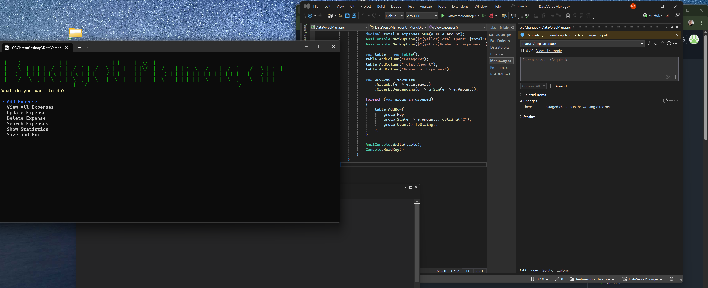

# DataVerseManager 

A terminal-based budget and expense manager built in C# using Spectre.Console.

## Description
DataVerse Manager is a console application that lets you manage your expenses straight from the terminal. You can add, view, update, delete and search expenses. Everything gets saved to a JSON file so your data is still there next time you open the program.

## How to run
1. Clone the repository
2. Open the project in Visual Studio 2022
3. Click the green arrow button at the top to start the program
4. Use the arrow keys to navigate the menu and Enter to select

## Features
- Add new expenses with name, amount and category
- View all expenses in a table
- Update existing expenses
- Delete expenses by ID
- Search and filter by name or category
- Data is automatically saved to expenses.json when you exit

## Project structure
- Program.cs – this is where the program starts
- Models/ – contains the Expense class
- Services/ – DataStore for storing data and JsonService for reading and writing JSON files
- UI/ – MenuDisplay which handles all the menus and user interaction

## OOP concepts used
- Classes and encapsulation (Expense, DataStore, JsonService)
- Generic class DataStore<T> for flexible data storage
- Separation of concerns by splitting code into Models, Services and UI folders

## Technologies used
- C# / .NET
- Spectre.Console for the terminal UI
- System.Text.Json for saving and loading data
- LINQ for searching and filtering

## Class Design Overview

- **BaseEntity** - base class that holds Id and Date, shared by all models
- **Expense** - inherits from BaseEntity and adds Name, Amount and Category
- **DataStore<T>** - generic class that stores any type of object in a list
- **JsonService** - handles reading and writing data to a JSON file
- **MenuDisplay** - handles all user interaction and menus

## OOP Concepts
- **Encapsulation** - each class manages its own data
- **Inheritance** - Expense inherits Id and Date from BaseEntity
- **Polymorphism** - BaseEntity can represent any type of entity
- **Generic class** - DataStore<T> works with any data type

- - ## Screenshots

